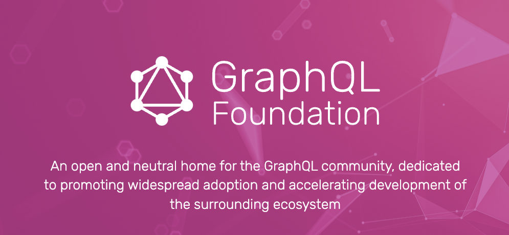

A query language for your API
GraphQL is a query language for APIs and a runtime for fulfilling those queries with your existing data. GraphQL provides a complete and understandable description of the data in your API, gives clients the power to ask for exactly what they need and nothing more, makes it easier to evolve APIs over time, and enables powerful developer tools.
```aidl
type Query {
me: User
}
```
OR

```aidl

type User {
id: ID
name: String
}
```
Along with functions for each field on each type:

```
function Query_me(request) {
  return request.auth.user;
}

function User_name(user) {
  return user.getName();
}
```


